# Настроить агрегацию портов
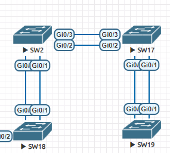

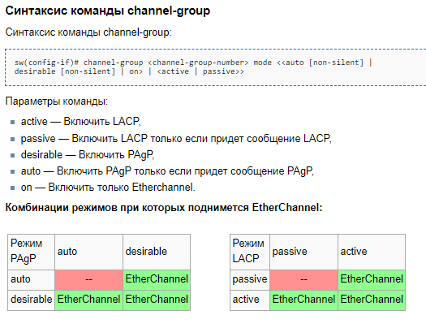
## Static 

**Описание:** Интерфейсы агрегируются без использования протокола управления. Администратор явно указывает, какие интерфейсы должны объединяться в EtherChannel.

**Протокол:** Отсутствует (агрегация задается вручную).

**Поддерживаемые устройства:** Поддерживается практически всеми устройствами.

**Преимущества:** 
+ Простота конфигурации, но менее гибкая по сравнению с динамическими протоколами.
+ Не вносит дополнительную задержку при поднятии агрегированного канала или изменении его настроек
+ 
**Недостатки:** Нет согласования настроек с удаленной стороной. Ошибки в настройке могут привести к образованию петель

настройка поизводится на switch 18 и 2 на портах Gi0/0-1
```
enable
config t
interface range Gi0/0-1
channel-group 1 mode on
no shutdown
exit
interface port-channel 1
switchport trunk encapsulation dot1q
switchport mode trunk
exit
exit
show running
wr
```
switch 2
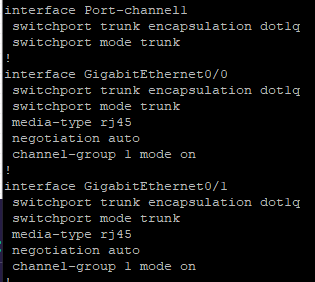
switch 18
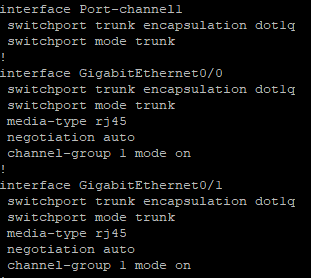
## LACP 

**Описание:** Это стандартный протокол IEEE 802.3ad, предназначенный для динамической агрегации каналов. Управление формированием канала и проверка работоспособности производятся динамически между поддерживающими устройствами.

**Протокол:** IEEE 802.3ad (стандартный протокол).

**Поддерживаемые устройства:** Широко поддерживается на устройствах различных производителей.

**Преимущества:** 
+ Согласование настроек с удаленной стороной позволяет избежать ошибок и петель в сети.
+ Поддержка standby-интерфейсов позволяет агрегировать до 16ти портов, 8 из которых будут активными, а остальные в режиме standby

**Недостатки:**
  + Вносит дополнительную задержку при поднятии агрегированного канала или изменении его настроек

настройка поизводится на switch 17 и 19 на портах Gi0/0-1
```
enable
config t
interface range Gi0/0-1
channel-group 3 mode active 
no shutdown
switchport trunk encapsulation dot1q
switchport mode trunk
exit
exit
show running
wr
```
switch 19
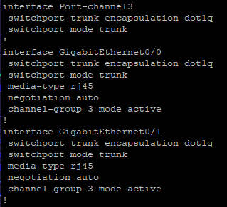
switch 17
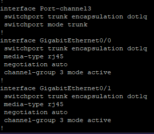

## PAgP

**Описание**: Проприетарный протокол Cisco, предназначенный для динамической агрегации каналов. Аналогичен LACP, но применяется только на оборудовании Cisco.

**Протокол**: Проприетарный протокол Cisco.

**Поддерживаемые устройства**: Только устройства Cisco.
        
**Преимущества**: Динамическое формирование канала, поддержка только на устройствах Cisco.


PAgP поддерживает два режима работы:
+ Автоматический (Auto): В этом режиме устройство ожидает инициативы со стороны других устройств для установления агрегированного канала.
+ Жесткий (On/Desirable): В этом режиме устройство активно инициирует запросы для формирования агрегированного канала.

настройка поизводится на switch 17 и 2 на портах Gi0/2-3
```
enable
config t
interface range Gi0/2-3
channel-group 2 mode desirable
no shutdown
exit
interface port-channel 2
switchport trunk encapsulation dot1q
switchport mode trunk
exit
exit
show running
wr
```
switch 17
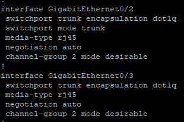
switch 2
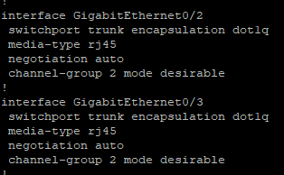

## Вопросы по теме
### максимальное количество портов для агрегации
*LACP* позволяет агрегировать до 16ти портов, 8 из которых будут активными, а остальные в режиме standby.

*PAgP* максимальное количество портов, которое можно объединить в один агрегированный канал (порт-чемел), зависит от конкретной модели оборудования и версии прошивки, однако в большинстве случаев PAgP позволяет объединить до 8 портов в один порт-чанел. 

*Static* максимальное количество портов, которое можно агрегировать, зависит от оборудования и производителя, в большинстве сетевых устройств можно агрегировать до 8 портов в один порт-чанел.


### что такое stand by
в случае, если один из портов в агрегированном канале выйдет из строя, вместо него поднимается standby порт


# LLDP

Каждое устройство, на котором включен LLDP, отправляет информацию о себе соседям независимо от того, отправляет ли сосед информацию о себе. При обмене сообщениями LLDP, не используется механизм запрос/ответ.

Устройство, использующее LLDP, хранит информацию о соседях, но не перенаправляет её дальше (независимо от того поддерживает ли устройство протокол LLDP).

Информация об устройстве, которая может передаваться с помощью LLDP:

+ Имя устройства (System Name),
+ Описание устройства (System Description),
+ Идентификатор порта (Port ID),
+ Описание порта (Port Description),
+ Возможности устройства (System Capabilities),
+ Управляющий адрес (Management Address),
+ и др.

Протокол работает только между непосредственно присоединенными устройствами. Это значит, что, например, на рисунке: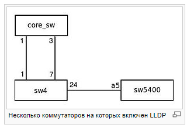

+ Коммутатор sw4 получит LLDP-информацию от двух соседей core_sw (через два порта) и sw5400;
+ Коммутатор core_sw получит LLDP-информацию только от sw4 (но через оба порта);
+ Коммутатор sw5400 получит LLDP-информацию только от sw4.
  
Сообщения LLDP могут передаваться через порты, которые заблокированы STP, но не передаются через порты, которые заблокированы 802.1X.


## включить lldp 
Настройка производится на SW18
```
enable
config t
lldp run
exit
show lldp
```
lldp включен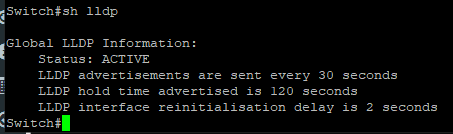


## посмотреть пакеты в wireshark

в wireshark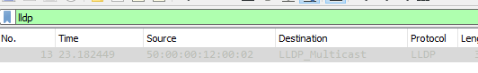

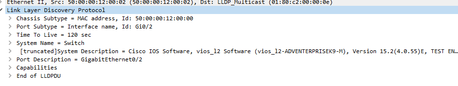

# Настроить SNMP

# НАстроить NAt
# НАстроить STP


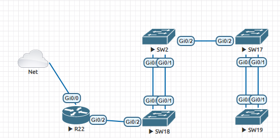

Настройка производится на R22

## добавить облако
```
enable
config t
interface  Gi0/0
no shutdown
ip address dhcp
do sh ip int br

```
у интерфейса теперь есть адрес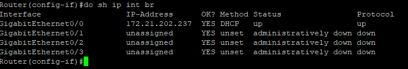

появился выход в интернет 


включение dhcp
```
#conf t
Enter configuration commands, one per line.  End with CNTL/Z.
Router(config)#int Gi 0/1
Router(config-if)#ip address 192.168.2.1 255.255.255.0
Router(config-if)#no shutdown
Router(config-if)#exit
Router(config)#ip dhcp excluded-address 192.168.2.10
Router(config)#ip dhcp excluded-address 192.168.2.1
Router(config)#ip dhcp pool poletolava
Router(dhcp-config)#network 192.168.2.0 255.255.255.0
Router(dhcp-config)#default-router 192.168.2.1
Router(dhcp-config)#exit
*Apr 23 13:57:54.010: %LINK-3-UPDOWN: Interface GigabitEthernet0/1, changed state to up
*Apr 23 13:57:55.010: %LINEPROTO-5-UPDOWN: Line protocol on Interface GigabitEthernet0/1, changed state to up
Router(config)#
Router(config)#do wr

```


int Gi 0/1
ip address 192.168.2.1 255.255.255.0
no shutdown
exit
ip dhcp excluded-address 192.168.2.10
ip dhcp excluded-address 192.168.2.1
ip dhcp pool poletolava
network 192.168.2.0 255.255.255.0
default-router 192.168.2.1
exit


enable
config t
interface  Gi0/1
no shutdown
ip address dhcp
do sh ip int br
