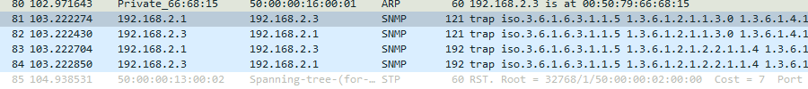

# Настроить агрегацию портов


## Static 

**Описание:** Интерфейсы агрегируются без использования протокола управления. Администратор явно указывает, какие интерфейсы должны объединяться в EtherChannel.

**Протокол:** Отсутствует (агрегация задается вручную).

**Поддерживаемые устройства:** Поддерживается практически всеми устройствами.

**Преимущества:** 
+ Простота конфигурации, но менее гибкая по сравнению с динамическими протоколами.
+ Не вносит дополнительную задержку при поднятии агрегированного канала или изменении его настроек
+ 
**Недостатки:** Нет согласования настроек с удаленной стороной. Ошибки в настройке могут привести к образованию петель

настройка поизводится на switch 18 и 2 на портах Gi0/0-1
```
enable
config t
interface range Gi0/0-1
channel-group 1 mode on
no shutdown
exit
interface port-channel 1
switchport trunk encapsulation dot1q
switchport mode trunk
exit
exit
show running
wr
```
switch 2

switch 18

## LACP 

**Описание:** Это стандартный протокол IEEE 802.3ad, предназначенный для динамической агрегации каналов. Управление формированием канала и проверка работоспособности производятся динамически между поддерживающими устройствами.

**Протокол:** IEEE 802.3ad (стандартный протокол).

**Поддерживаемые устройства:** Широко поддерживается на устройствах различных производителей.

**Преимущества:** 
+ Согласование настроек с удаленной стороной позволяет избежать ошибок и петель в сети.
+ Поддержка standby-интерфейсов позволяет агрегировать до 16ти портов, 8 из которых будут активными, а остальные в режиме standby

**Недостатки:**
  + Вносит дополнительную задержку при поднятии агрегированного канала или изменении его настроек

LACP поддерживает два режима работы:
+ Active: В этом режиме устройство ожидает инициативы со стороны других устройств для установления агрегированного канала.
+ Passive: В этом режиме устройство активно инициирует запросы для формирования агрегированного канала.

настройка поизводится на switch 17 и 19 на портах Gi0/0-1
```
enable
config t
interface range Gi0/0-1
channel-group 3 mode active 
no shutdown
switchport trunk encapsulation dot1q
switchport mode trunk
exit
exit
show running
wr
```
switch 19

switch 17


## PAgP

**Описание**: Проприетарный протокол Cisco, предназначенный для динамической агрегации каналов. Аналогичен LACP, но применяется только на оборудовании Cisco.

**Протокол**: Проприетарный протокол Cisco.

**Поддерживаемые устройства**: Только устройства Cisco.
        
**Преимущества**: Динамическое формирование канала, поддержка только на устройствах Cisco.


PAgP поддерживает два режима работы:
+ Автоматический (Auto): В этом режиме устройство ожидает инициативы со стороны других устройств для установления агрегированного канала.
+ Жесткий (On/Desirable): В этом режиме устройство активно инициирует запросы для формирования агрегированного канала.

настройка поизводится на switch 17 и 2 на портах Gi0/2-3
```
enable
config t
interface range Gi0/2-3
channel-group 2 mode desirable
no shutdown
exit
interface port-channel 2
switchport trunk encapsulation dot1q
switchport mode trunk
exit
exit
show running
wr
```
switch 17

switch 2


## Вопросы по теме
### максимальное количество портов для агрегации
*LACP* позволяет агрегировать до 16ти портов, 8 из которых будут активными, а остальные в режиме standby.

*PAgP* максимальное количество портов, которое можно объединить в один агрегированный канал (порт-чемел), зависит от конкретной модели оборудования и версии прошивки, однако в большинстве случаев PAgP позволяет объединить до 8 портов в один порт-чанел. 

*Static* максимальное количество портов, которое можно агрегировать, зависит от оборудования и производителя, в большинстве сетевых устройств можно агрегировать до 8 портов в один порт-чанел.

### что такое stand by
в случае, если один из портов в агрегированном канале выйдет из строя, вместо него поднимается standby порт


# LLDP

Каждое устройство, на котором включен LLDP, отправляет информацию о себе соседям независимо от того, отправляет ли сосед информацию о себе. При обмене сообщениями LLDP, не используется механизм запрос/ответ.

Устройство, использующее LLDP, хранит информацию о соседях, но не перенаправляет её дальше (независимо от того поддерживает ли устройство протокол LLDP).

Информация об устройстве, которая может передаваться с помощью LLDP:

+ Имя устройства (System Name),
+ Описание устройства (System Description),
+ Идентификатор порта (Port ID),
+ Описание порта (Port Description),
+ Возможности устройства (System Capabilities),
+ Управляющий адрес (Management Address),
+ и др.

Протокол работает только между непосредственно присоединенными устройствами. Это значит, что, например, на рисунке:

+ Коммутатор sw4 получит LLDP-информацию от двух соседей core_sw (через два порта) и sw5400;
+ Коммутатор core_sw получит LLDP-информацию только от sw4 (но через оба порта);
+ Коммутатор sw5400 получит LLDP-информацию только от sw4.
  
Сообщения LLDP могут передаваться через порты, которые заблокированы STP, но не передаются через порты, которые заблокированы 802.1X.

## включить lldp 
Настройка производится на SW18
```
enable
config t
lldp run
exit
wr
show lldp
```
lldp включен

## посмотреть пакеты в wireshark

в wireshark


# Настроить SNMP


## включение dhcp


настройка идет на R22
```
int Gi 0/1
ip address 192.168.2.1 255.255.255.0
no shutdown
exit
ip dhcp excluded-address 192.168.2.10
ip dhcp excluded-address 192.168.2.1
ip dhcp pool poletolava
network 192.168.2.0 255.255.255.0
default-router 192.168.2.1
exit
wr
```

## включение SNMP
настройка идет на R22
```
ip access-list standard SNMP_ACL
permit host 192.168.2.3
exit
snmp-server community TEST ro SNMP_ACL
snmp-server host 192.168.2.3 version 1 TEST
snmp-server enable traps snmp
do wr
```
+ Команда 1 — создание списка доступа (SNMP_ACL).
+ Команда 2 — разрешает взаимодействие было только с указанным компьютером (192.168.2.3).
+ Команда 3 — возврат из режима конфигурирования списка доступа (config-std-nacl)# в режим глобальной конфигурации (config)#.
+ Команда 4 — создаём Агент SNMP (строку сообщества TEST) только для чтения (ro) - диспетчер сможет считывать значения параметров, но не сможет записывать новые значения и наконец, привязываем список доступа.
+ Команда 5 — указываем куда отсылать данные при срабатывании ловушки (192.168.2.3) и версия 1, для версии 2 будет - 2c вместо 1, имя сообщества (TEST).
+ Команда 6 — включаем ловушки и определяем какие именно ловушки нас интересуют (snmp).

Trap – одностороннее уведомление от SNMP агента –> менеджеру о каком-либо событии.


прослушка идет у коммутатора SW19 на интерфейсе Gi0/2



+ `Simple Network Management Protocol`: Указывает, что пакет содержит данные SNMP.
  + `version`: version-1 (0): Используемая версия SNMP — версия 1.
  + `community`: TEST: Имя сообщества (community), используемое в SNMPv1, в данном случае — "TEST". Это простой механизм аутентификации, но менее безопасный.
  + `data`: trap (4): Тип данных SNMP. Это Trap (уведомление), которое устройства могут отправлять менеджерам SNMP, когда происходят определенные события.
    + `trap`: Данные Trap содержат следующие компоненты:
      + `enterprise: 1.3.6.1.6.3.1.1.5`: Идентификатор объекта (OID), указывающий на организацию или предприятие, которое посылает Trap.
      + `agent-addr: 192.168.2.1`: IP-адрес агента SNMP, который отправляет Trap.
      + `generic-trap: coldStart (0)`: Общий тип Trap. coldStart (значение 0) означает, что устройство или агент перезапустился.
      + `specific-trap: 0`: Специфический тип Trap. В данном случае 0, поскольку coldStart не имеет дополнительных деталей.
      + `time-stamp: 5455`: Временная метка, указывающая время с момента запуска устройства или системы.
      + `variable-bindings: 2` items: Количество переменных, которые привязаны к Trap. Обычно это дополнительные данные или параметры, передаваемые с Trap.
        + `1.3.6.1.2.1.1.3.0: 2432`
          + `Object Name`: Это идентификатор объекта (OID), который указывает на системный объект, содержащий информацию о времени.
          + `Value (Timeticks): 2432`: Значение переменной, представляющее время в "timeticks" (единицы измерения времени в SNMP, где один "timetick" равен 0,01 секунды). Значение 2432 timeticks означает, что прошло 24,32 секунды (2432 * 0,01).
        + `1.3.6.1.4.1.9.2.1.2.0: 72656c6f6164`
          + `Object Name`: Это другой идентификатор объекта, который указывает на специфический объект или параметр.
          + `Value (OctetString): 72656c6f6164`: Значение этой переменной в виде "OctetString" (байтовая строка), представленное в шестнадцатеричном виде. Если преобразовать это значение из шестнадцатеричного формата в текст, оно будет представлять строку "reload". Это может указывать на команду или действие, которое инициировало Trap или является частью данных об этом событии.

 первый OID указывает на системное время, прошедшее с момента запуска, а второй может содержать команду или инструкцию, которая вызвала событие или Trap.


+ `Simple Network Management Protocol` Обозначает, что данные в этом пакете относятся к протоколу SNMP.
  + `version`: version-1 (0) Указывает, что используется первая версия SNMP.
  + `community`: TEST Имя сообщества SNMP, используемое для аутентификации. В SNMPv1 и SNMPv2c "community" — это строка, которая действует как простой пароль. В данном случае, сообщество + называется "TEST".
  + `data`: trap (4) Определяет тип данных SNMP. В данном случае, это "trap" (уведомление).
    + `trap` Определяет структуру Trap-сообщения.
      + `enterprise: 1.3.6.1.6.3.1.1.5 (iso.3.6.1.6.3.1.1.5)` Идентификатор объекта (OID), который указывает на организацию или предприятие, посылающее Trap.
      + `agent-addr`: 192.168.2.1 IP-адрес агента SNMP, который отправил Trap.
      + `generic-trap`: linkDown (2) Указывает общий тип Trap. "linkDown" (значение 2) означает, что произошло отключение сетевого соединения или одного из интерфейсов.
      + `specific-trap`: 0 Специфический тип Trap. В этом случае, значение 0 означает, что нет дополнительных деталей или специфических событий.
      + `time-stamp`: 5456 Временная метка, указывающая время (в сотых долях секунды), прошедшее с момента перезапуска устройства или системы, до момента отправки Trap.
      + `variable-bindings`: 4 items Число переменных, которые привязаны к этому Trap-сообщению. Переменные могут содержать дополнительную информацию или параметры, связанные с событием "linkDown".
        + `1.3.6.1.2.1.2.2.1.1.4: 4`
          + `Object Name`: Этот идентификатор объекта (OID) указывает на параметр, связанный с сетевым интерфейсом.
          + `Value (Integer32): 4`: Значение переменной, представленное как целое число. Оно может обозначать индекс интерфейса в таблице интерфейсов IB (Management Information Base), что может использоваться для идентификации конкретного интерфейса.
        + `1.3.6.1.2.1.2.2.1.2.4: 4769676162697445746865726e6574302f33`
          + `Object Name`: Этот OID связан с названием интерфейса.
          + `Value (OctetString): 4769676162697445746865726e6574302f33`: Значение в виде "OctetString" (байтовая строка), представленной в шестнадцатеричном формате. Если преобразовать это значение в текст, оно будет соответствовать строке "GigabitEthernet0/3", что указывает на имя сетевого интерфейса.
        + `1.3.6.1.2.1.2.2.1.3.4: 6`
          + `Object Name`: Этот OID указывает на тип интерфейса.
          + `Value (Integer32): 6`: Значение, которое, в контексте интерфейсов, обычно обозначает тип Ethernet (значение 6 в MIB-II).
        + `1.3.6.1.4.1.9.2.2.1.1.20.4: 61646d696e6973747261746976656c7920646f776e`
          + `Object Name`: Этот OID указывает на специальный параметр, связанный с уведомлениями или логами.
          + `Value (OctetString): 61646d696e6973747261746976656c7920646f776e`: Шестнадцатеричное значение, которое при преобразовании в текст становится "administratively down". Это может указывать на причину события, например, на административное отключение интерфейса.

В совокупности, эти переменные дают дополнительный контекст к событию Trap, которое может быть связано с конкретным сетевым интерфейсом, его именем, типом, индексом, а также возможной причиной отключения (administratively down).


# Настроить NAT
Зарезервированные под локальные адреса (серые адреса):
+ 10.0.0.0/8 (10.0.0.0-10.255.255.255)
+ 172.16.0.0/12 (172.16.0.0-172.31.255.255)
+ 192.168.0.0/16 (192.168.0.0-192.168.255.255)

У них нет доступа к глобальной сети, поэтому нужен NAT, позволяющий изменять IP адрес в заголовке пакета, проходящего через устройство маршрутизации трафика.
Принимая пакет от локального компьютера, маршрутизатор смотрит на IP-адрес назначения. Если это локальный адрес, то пакет пересылается другому локальному компьютеру. Если нет, то пакет надо переслать наружу в интернет.

Маршрутизатор подменяет обратный IP-адрес пакета на свой внешний (видимый из интернета) IP-адрес и меняет номер порта (чтобы различать ответные пакеты, адресованные разным локальным компьютерам). Комбинацию, нужную для обратной подстановки, маршрутизатор сохраняет у себя во временной таблице. Через некоторое время после того, как клиент и сервер закончат обмениваться пакетами, маршрутизатор сотрет у себя в таблице запись об n-ом порте за сроком давности.

[информация про NAT](https://habr.com/ru/articles/583172/)

## добавить облако
настройка идет на R22
```
enable
config t
interface  Gi0/0
no shutdown
ip address dhcp
do wr
do sh ip int br
```
## включить NAT
настройка идет на R22
```
conf t
access-list 1 permit 192.168.2.0 0.0.0.255
ip nat source list 1 interface Gi0/0 overload
interface Gi0/1
ip nat enable
exit
interface Gi0/0
ip nat enable
do wr
```
компьютер до настройки не пингует гугл


после настройки гугл пингуется


+ `Access-list 1 permit 192.168.2.0 0.0.0.255`: Создается список доступа, который разрешает диапазон IP-адресов 192.168.2.0/24. Эта команда определяет, какие внутренние (частные) адреса будут использовать NAT для выхода в Интернет.
+ `Ip nat source list 1 interface Gi0/0 overload`: Настраивает NAT для преобразования адресов, используя список доступа 1. Все адреса из этого списка будут отображаться через интерфейс Gi0/0. Ключевое слово "overload" означает, что NAT будет использовать метод "PAT" (Port Address Translation), что позволяет использовать один публичный IP-адрес для множества внутренних адресов, добавляя уникальный порт для каждого подключения.
+ `Interface Gi0/1`
+ `Ip nat enable`: Включение NAT на интерфейсе Gi0/1. Это означает, что трафик, проходящий через этот интерфейс, будет обрабатываться в соответствии с правилами NAT.
+ `Exit`
+ `Interface Gi0/0`
+ `Ip nat enable`:Включение NAT на интерфейсе Gi0/0. Это интерфейс, который используется для выхода в Интернет, поэтому включение NAT здесь означает, что внутренние IP-адреса будут преобразовываться в публичный IP-адрес при выходе из этой точки.


# Настроить STP

```
en
show spanning-tree
spanning-tree vlan 1 priority 4096
```

STP (Spanning Tree Protocol) — это протокол, используемый в сетях Ethernet для предотвращения петлей (циклов), которые могут возникнуть из-за избыточных маршрутов или неправильной конфигурации. Петли в сетях могут вызвать серьезные проблемы, такие как широковещательные штормы, потеря данных и сбои в работе сети. STP предназначен для решения этой проблемы, обеспечивая единственный путь между узлами в сети и блокируя избыточные маршруты.

Как работает STP:
1. **Определение корневого моста:**
STP выбирает один коммутатор в качестве "корневого моста" (root bridge) на основе наименьшего идентификатора (Bridge ID), который обычно определяется по приоритету коммутатора и его MAC-адресу. Этот корневой мост станет центральной точкой сети.
2. **Определение кратчайшего пути к корневому мосту:**
Каждый коммутатор в сети определяет кратчайший путь к корневому мосту на основе "стоимости" пути (обычно определяется скоростью и количеством переходов). Порты, которые обеспечивают кратчайший путь к корневому мосту, становятся "корневыми портами" (root ports).
3. **Выбор назначенных портов:**
После определения корневого порта каждый коммутатор выбирает "назначенные порты" (designated ports), которые будут использоваться для передачи данных. Они обычно находятся на каждом сегменте сети и обеспечивают лучший путь из сегмента к корневому мосту.
4. **Блокировка избыточных портов:**
Порты, которые не являются ни корневыми, ни назначенными, блокируются, чтобы предотвратить создание петель в сети.
5. **Обнаружение изменений в сети:**
STP периодически отправляет BPDU (Bridge Protocol Data Unit) для отслеживания изменений в сети. Если происходит изменение (например, добавляется или удаляется коммутатор), STP пересчитывает топологию и выбирает новые корневые порты и назначенные порты, чтобы поддерживать единственный путь без петель.


